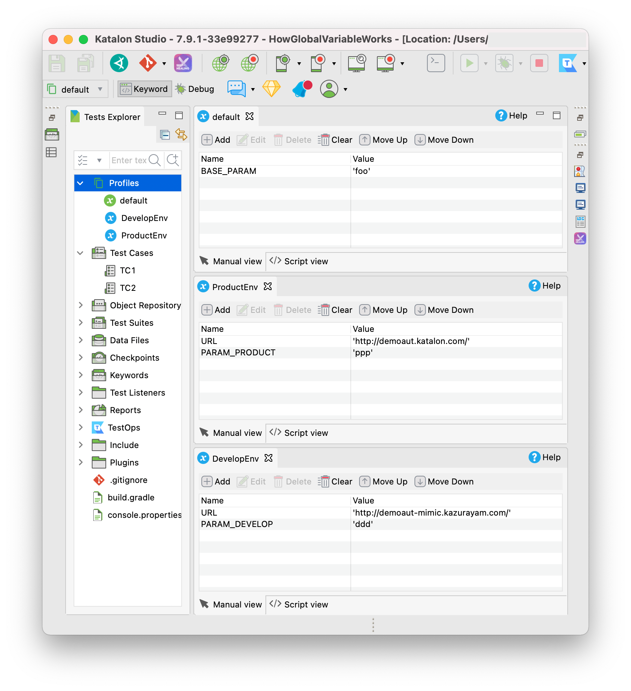

# [Katalon Studo] How GlobalVariable works

## Problem to solve

In a small Katalon Studio project, I have made 3 Execution Profiles. All of GlobalVariables are String type.

### "`default`" Profile
|name|value|
|:---|:----|
|BASE_PARAM|foo|

### "`ProductEnv`" Profile
|name|value|
|:---|:----|
|URL|http://demoaut.katalon.com/|
|PARAM_PRODUCT|ppp|

### "`DevelopEnv`" Profile
|name|value|
|:---|:----|
|URL|http://demoaut-mimic.kazurayam.com/|
|PARAM_DEVELOP|ppp|



I have got questions.

*I have prepared 3 Execution Profiles in which 4 GlobalVariables are defined. But I have to choose one of the 3 Profiles to run a test case.  For example, when I choose the `ProductEnv` Profile, I expect 2 GlobalVariables in that Profile`URL` and `PARAM_PRODUCT` to be present and accessible. But how about the other 2 GlobalVariables `BASE_PARAM` and `PARAM_DEVELOP`? Are they present? If present, what value do I see?*

## Solution

I have developed a set of custom Groovy classes that provides capabilities to inspect `internal.GlobalVariables` object.

https://github.com/kazurayam/ExecutionProfilesLoader

We can get answers to the questions above by a short script.

## Description

I wrote a Test Case [`Test Cases/TC2`](Scripts/TC2/Script1625805775316.groovy). This script uses `com.kazurayam.ks.ExpandoGlobalVariable` class to inspect the runtime state of `internal.GlobalVariable` object. Alos it demonstrates how to use `com.kazurayam.ks.ExecutionProfilesLoader` class, which enable us to dynamically add a new GlobalVariable runtime withouth preparing a Execution Profile through Katalon GUI.

I ran this script 3 times while applying Execution Profiles `default`, `ProductEnv` and `DevelopEnv` each. The flowing table shows the result.

### Test Case output with "`default`" Profile

```
Execution Profile applied                       : default
GlobalVariable.BASE_PARAM is present?           : true
GlobalVariable.BASE_PARAM value                 : foo
GlobalVariable.URL is present?                  : true
GlobalVariable.URL value                        : null
GlobalVariable.PARAM_PRODUCT is present?        : true
GlobalVariable.PARAM_PRODUCT value              : null
GlobalVariable.PARAM_DEVELOP is present?        : true
GlobalVariable.PARAM_DEVELOP value              : null
```

### Test Case output with "`ProductEnv`" Profile

```
Execution Profile applied                       : ProductEnv
GlobalVariable.BASE_PARAM is present?           : true
GlobalVariable.BASE_PARAM value                 : foo
GlobalVariable.URL is present?                  : true
GlobalVariable.URL value                        : http://demoaut.katalon.com/
GlobalVariable.PARAM_PRODUCT is present?        : true
GlobalVariable.PARAM_PRODUCT value              : ppp
GlobalVariable.PARAM_DEVELOP is present?        : true
GlobalVariable.PARAM_DEVELOP value              : null
```

### Test Case output with "`DevelopEnv`" Profile

```
Execution Profile applied                       : DevelopEnv
GlobalVariable.BASE_PARAM is present?           : true
GlobalVariable.BASE_PARAM value                 : foo
GlobalVariable.URL is present?                  : true
GlobalVariable.URL value                        : http://demoaut-mimic.kazurayam.com/
GlobalVariable.PARAM_PRODUCT is present?        : true
GlobalVariable.PARAM_PRODUCT value              : null
GlobalVariable.PARAM_DEVELOP is present?        : true
GlobalVariable.PARAM_DEVELOP value              : ddd
```

### Analysis

Here I will list concrete questions and answeres based on the above data:

Q1. When I ran a Test Case with the "`default`" Profile applied, is the `GlobalVariable.URL` present? Is it accessible for the test case?

> In that case, `GlobalVariable.URL` is present. But the value is null.

Q2. When I ran a Test Case with the "`default`" Profile applied, what value of `GlobalVariable.PARAM_PRODUCT` can  the test case see?

> In that case, `GlobalVariable.PARAM_PRODUCT` is present. But the value is null.

Q3. When I ran a Test Case with the "`ProductionEnv`" Profile applied, is the `GlobalVariable.BASE_PARAM` defined in the `default` present? Is it accessible for the test case? What value of `GlobalVariable.BASE_PARAM` can the test case see?

> In that case, `GlobalVariable.BASE_PARAM` is present, and the value ("`foo`") is available for the test case. This means that the GlobalVariables defined in the `default` Profile is always visible regardles which Profile is actually chosen.

Q4. When I ran a Test Case with the "`ProductionEnv`" Profile applied, is the `GlobalVariable.PARAM_DEVELOP` defined in the `DevelopEnv` present? Is it accessible for the test case? What value of `GlobalVariable.PARAM_DEVELOP` can the test case see?

> In that case, `GlobalVariable.PARAM_DEVELOP` is present. But the value is null.

### APPENDIX: loading Execution Profiles

The Test Case [`Test Cases/TC3`](Scripts/TC3/Script1625824414513.groovy) casts a spell:
```
CustomKeywords."com.kazurayam.ks.globalvariable.ExecutionProfilesLoader.loadProfile"("ProductEnv")
...

This is just the same as:

```
new ExecutionProfilesLoader().loadProfile("ProductEnv")
```

Also you can load multiple Execution Profiles at a time like this:

```
new ExecutionProfilesLoader().loadProfiles("ProductEnv", "DevelopEnv")
```

TC3 emits the following output in the Console:

```
2021-07-09 19:02:43.196 DEBUG testcase.TC3                             - 1: appliedProfile = getExecutionProfile()

2021-07-09 19:02:43.201 DEBUG testcase.TC3                             - 2: println("Execution Profile applied                       : " + appliedProfile)
Execution Profile applied                       : default

2021-07-09 19:02:43.219 DEBUG testcase.TC3                             - 3: println("GlobalVariable.URL is present before loading?   : " + ExpandoGlobalVariable.isGlobalVariablePresent("URL"))
GlobalVariable.URL is present before loading?   : true

2021-07-09 19:02:43.715 DEBUG testcase.TC3                             - 4: println("GlobalVariable.URL value before loading         : " + ExpandoGlobalVariable.getGlobalVariableValue("URL"))
GlobalVariable.URL value before loading         : null

2021-07-09 19:02:43.745 DEBUG testcase.TC3                             - 5: com.kazurayam.ks.globalvariable.ExecutionProfilesLoader.loadProfile("ProductEnv")
2021-07-09 19:02:44.027 INFO  k.k.c.m.CustomKeywordDelegatingMetaClass - com.kazurayam.ks.globalvariable.ExecutionProfilesLoader.loadProfile is PASSED

2021-07-09 19:02:44.028 DEBUG testcase.TC3                             - 6: println("GlobalVariable.URL is present after loading?    : " + ExpandoGlobalVariable.isGlobalVariablePresent("URL"))
GlobalVariable.URL is present after loading?    : true

2021-07-09 19:02:44.031 DEBUG testcase.TC3                             - 7: println("GlobalVariable.URL value after loading          : " + ExpandoGlobalVariable.getGlobalVariableValue("URL"))
GlobalVariable.URL value after loading          : http://demoaut.katalon.com/

2021-07-09 19:02:44.036 DEBUG testcase.TC3                             - 8: ExecutionProfilesLoader().loadProfiles("ProductEnv", "DevelopEnv")

2021-07-09 19:02:44.190 DEBUG testcase.TC3                             - 9: println("GlobalVariable.URL is present after clear?      : " + ExpandoGlobalVariable.isGlobalVariablePresent("URL"))
GlobalVariable.URL is present after clear?      : true

2021-07-09 19:02:44.196 DEBUG testcase.TC3                             - 10: println("GlobalVariable.URL value after clear            : " + ExpandoGlobalVariable.getGlobalVariableValue("URL"))
GlobalVariable.URL value after clear            : http://demoaut-mimic.kazurayam.com/

2021-07-09 19:02:44.198 DEBUG testcase.TC3                             - 11: println("GlobalVariable.PARAM_PRODUCT is present?        : " + ExpandoGlobalVariable.isGlobalVariablePresent("PARAM_PRODUCT"))
GlobalVariable.PARAM_PRODUCT is present?        : true

2021-07-09 19:02:44.200 DEBUG testcase.TC3                             - 12: println("GlobalVariable.PARAM_PRODUCT                    : " + ExpandoGlobalVariable.getGlobalVariableValue("PARAM_PRODUCT"))
GlobalVariable.PARAM_PRODUCT                    : ppp

2021-07-09 19:02:44.209 DEBUG testcase.TC3                             - 13: println("GlobalVariable.PARAM_DEVELOP is present?        : " + ExpandoGlobalVariable.isGlobalVariablePresent("PARAM_DEVELOP"))
GlobalVariable.PARAM_DEVELOP is present?        : true

2021-07-09 19:02:44.214 DEBUG testcase.TC3                             - 14: println("GlobalVariable.PARAM_DEVELOP                    : " + ExpandoGlobalVariable.getGlobalVariableValue("PARAM_DEVELOP"))
GlobalVariable.PARAM_DEVELOP                    : ddd

2021-07-09 19:02:44.222 DEBUG testcase.TC3                             - 15: ExecutionProfilesLoader().clear()

2021-07-09 19:02:44.230 DEBUG testcase.TC3                             - 16: println("GlobalVariable.URL is present after clear?      : " + ExpandoGlobalVariable.isGlobalVariablePresent("URL"))
GlobalVariable.URL is present after clear?      : true

2021-07-09 19:02:44.233 DEBUG testcase.TC3                             - 17: println("GlobalVariable.URL value after clear            : " + ExpandoGlobalVariable.getGlobalVariableValue("URL"))
GlobalVariable.URL value after clear            : http://demoaut-mimic.kazurayam.com/
```

This proves that, even when I started the Test Case with the Execution Profile "`default`" selected, I can explicitly load other Execution Profiles "`ProductEnv`" and "`DevelopEnv`". As you can see, the property "`URL`" of the `internal.GlobalVariable` object is updated by the values from the loaded Profiles.

### APPENDIX: adding a GlobalVariable dynamically

The Test Case [`Test Cases/TC4`](Scripts/TC4/Script1625824407891.groovy) casts a spell:

```
new ExecutionProfilesLoader.loadEntries(["ADDED": "Hello, world!"])
```

This statement adds the `GlobalVariable.ADDED` with value `Hello, world!`. The name `ADDED` does not appear in the prepared 3 Execution Profiles. This means, using this custom class, you can create any number of GlobalVariables runtime.

Also another spell:
```
new ExecutionProfilesLoader().clear()
```

The `clear()` methods erases all properties added into the `internal.GlobalVariable` object by the `loadEntries` call.

TC4 emits the following output in the Console
```
Execution Profile applied                       : default
GlobalVariable.ADDED is present before loading? : false
GlobalVariable.ADDED is present after loading?  : true
GlobalVariable.ADDED value                      : Hello, world!
GlobalVariable.ADDED is present after clear?    : false
GlobalVariable.ADDED value after clear          : null
```

## Conclusion

The artifact of [ExecutionProfilesLoader](https://github.com/kazurayam/ExecutionProfilesLoader) will make my work on Katalon Studio easier.


